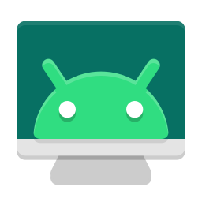

# 📱 Android-Mirror (Aura SCRCPY v4.1 PRO)

<p align="center">
  
</p>

<p align="center">
  <strong>Painel Desktop Moderno, Tecnológico e Otimizado para o SCRCPY v4.1</strong><br>
  Transforme seu smartphone Android em uma <strong>Webcam DSLR de Estúdio (1080p 60 FPS)</strong> ou em uma central de espelhamento com <strong>latência zero</strong> via Wi-Fi ou Cabo USB.
</p>

<p align="center">
  
  
  
  
  
</p>

---

## ✨ Visão Geral

O **Android-Mirror** substitui inicializadores legados ou linhas de comando manuais por uma aplicação desktop elegante em **C# / WPF (Dark Fluent)** com aceleração por hardware, persistência de configurações e ícone oficial integrado.

Projetado especialmente para **criadores de conteúdo, streamers e profissionais**, o painel desbloqueia o poder bruto do **SCRCPY** com uma interface acessível e intuitiva, sem a necessidade de editar scripts ou memorizar flags de terminal.

---

## 🚀 Principais Recursos

### 🎥 1. Módulo Webcam Estúdio Pro (1 Clique)
* **Qualidade de Câmera Profissional:** Transmite o sensor físico do smartphone em até **1080p a 60 FPS** (ou 4K) com codec H.264/H.265 e bitrate de estúdio (24 Mbps).
* **Orientação Vertical Automática (90°):** Corrige o sensor do celular apoiado em pé em suportes verticais sem que a imagem fique deitada.
* **Janela Sem Bordas (`--window-borderless`):** Janela limpa com título fixo (`Aura Webcam Pro`), ideal para captura no **OBS Studio** e **NVIDIA Broadcast**.
* **Blindagem de Servidor:** Previne conflitos de flags (como desligamento acidental de tela física `-S`) que derrubam o subsistema de câmera do Android.

### 👻 2. Modo Invisível & Alternância Dinâmica de Janela (Zero Tela Preta)
* **O Problema Tradicional:** No Windows, minimizar uma janela suspende a renderização da GPU pelo DWM, deixando a fonte do OBS e do NVIDIA Broadcast com **tela preta**.
* **A Solução Aura:** O botão dinâmico **`👻 Ocultar / 👁️ Mostrar`** move a janela instantaneamente para coordenadas off-screen nativas (`-32000, -32000`) em tempo real:
  * A janela **sai da sua frente** e não ocupa espaço nos seus monitores.
  * O Windows **continua renderizando a 60 FPS**, mantendo o OBS e o NVIDIA Broadcast funcionando sem interrupção.
  * Quer conferir o enquadramento? Um clique em **`👁️ Mostrar`** e a janela reaparece na sua tela na hora!

### ⌨️ 3. Ocultação Inteligente do Teclado Virtual (Modo Físico UHID)
* **O Problema Tradicional:** Ao clicar em campos de texto no celular pelo PC, o Android abre o teclado virtual (Gboard, SwiftKey), cobrindo metade da tela e encurtando o espaço de visualização.
* **A Solução Aura:** A ferramenta **`⌨️ Ocultar Teclado Virtual (UHID)`** simula um teclado físico de hardware no kernel Linux (`--keyboard=uhid`) e desativa a exibição do teclado na tela via ADB (`show_ime_with_hard_keyboard 0`):
  * **100% de Visão Preservada:** Os campos de texto recebem a digitação diretamente do seu teclado físico do computador sem que nenhuma barra virtual suba na tela.
  * **Configuração Simplificada:** Use o atalho **`Alt + K`** a qualquer momento para ajustar o layout do teclado físico diretamente no Android (ex: ABNT2 ou US Internacional).
  * **Restauração Automática:** Ao encerrar o espelhamento, as configurações originais do teclado são restauradas no dispositivo.

### ⚡ 4. Perfis Rápidos de Desempenho
Alterne instantaneamente entre configurações pré-calibradas:

| Perfil | FPS | Bitrate | Resolução | Buffer | Áudio | Foco |
| :--- | :---: | :---: | :---: | :---: | :---: | :--- |
| **⚡ Ultra Competitivo** | 90/120 | 24M | 1080p | 0 ms | Mudo | Resposta instantânea para jogos rápidos |
| **🎮 Gaming Fluido** | 90 | 16M | 1600p | 25 ms | Opus | Jogabilidade suave com áudio de baixa latência |
| **⚖️ Equilibrado Diário** | 60 | 10M | 1080p | 50 ms | Opus | Produtividade e visualização do dia a dia |
| **📺 Apresentação / 2K** | 60 | 28M | 2560p | 50 ms | Opus | Tutoriais e reuniões (exibe toques na tela `-t`) |
| **🔋 Wi-Fi Econômico** | 60 | 6M | 720p | 80 ms | Mudo | Conexões instáveis e economia de largura de banda |
| **🎥 Webcam Pro** | 60 | 24M | 1080p | 80 ms | Mudo | Otimizado para OBS, Zoom e NVIDIA Broadcast |

### 📶 5. Conectividade Inteligente & Detecção Wi-Fi
* **Varredura mDNS Automática:** Detecta as portas dinâmicas sorteadas pela Depuração por Wi-Fi do **Android 11, 12, 13, 14, 15 e 16** e conecta com 1 clique no botão `🔍 Auto-Detectar`.
* **Fixação de Porta 5555:** Abra a porta clássica 5555 direto pela conexão de rede ou pelo cabo.
* **Teste de Latência (Ping):** Medidor ICMP integrado com diagnóstico visual por cores (Verde: < 20ms, Amarelo: 20-45ms, Vermelho: > 45ms).
* **Hotplug USB em Tempo Real:** Identifica automaticamente quando o aparelho é conectado ou desconectado e exibe o modelo real.

---

## 🛠️ Como Usar

### Pré-requisitos
1. Um smartphone Android com a **Depuração USB** ativada nas *Opções do Desenvolvedor*.
2. Computador com Windows 10 ou 11.

### Início Rápido
1. Baixe ou clone este repositório.
2. Execute o arquivo **`AuraScrcpyLauncher.exe`** (ou dê um duplo clique no atalho com ícone oficial).
3. **Modo Cabo USB:**
   * Plugue o cabo USB.
   * Escolha o perfil desejado e clique em **🚀 INICIAR ESPELHAMENTO**.
4. **Modo Wi-Fi (Sem Fio):**
   * Plugue o cabo USB e clique em **📲 Ativar Wi-Fi (TCP/IP)** (ou ative *Depuração sem fio* no Android e clique em **🔍 Auto-Detectar**).
   * Desconecte o cabo e clique em **🚀 INICIAR ESPELHAMENTO**.

---

## 🎬 Integrando com OBS Studio & NVIDIA Broadcast

1. No launcher, clique em **`🎥 Ativar Modo Webcam Pro`** e inicie o espelhamento.
2. No **OBS Studio**:
   * Adicione uma fonte de **`Captura de Janela` (Window Capture)**.
   * Selecione a janela **`Aura Webcam Pro`**.
   * *(Opcional)* No painel de controles do OBS, clique em **Iniciar Câmera Virtual**.
3. No **NVIDIA Broadcast** (ou Zoom / Teams / Meet / Discord):
   * Selecione a câmera **OBS Virtual Camera**.
   * Aplique os efeitos de IA (Desfoque de Fundo, Enquadramento Automático, Contato Visual) com 0% de peso na CPU!
4. **Para limpar a sua Área de Trabalho:**
   * No launcher, clique em **`👻 Ocultar`**. A janela da câmera sai da tela sem que o OBS ou o Broadcast percam o sinal!

---

## ⌨️ Atalhos Úteis do Teclado

Durante a transmissão, você pode usar os seguintes atalhos rápidos:

| Atalho | Ação |
| :--- | :--- |
| **`Alt + P`** | Liga / Desliga a tela do smartphone |
| **`Alt + O`** | Apaga a tela física mantendo a transmissão ativa no PC |
| **`Alt + K`** | Abre configurações de layout do teclado físico no Android |
| **`Alt + F`** ou **`F11`** | Alterna entre Modo Janela e Tela Cheia |
| **`Alt + R`** | Rotaciona a tela do espelhamento |
| **`Alt + ←` / `Alt + →`** | Gira a imagem em 90° em tempo real (ideal para ajustar câmeras) |
| **`Alt + Shift + ←` / `→`** | Espelha a imagem horizontalmente ou verticalmente |
| **`Alt + H`** | Pressiona o botão Home (Início) do Android |
| **`Alt + B`** ou **Botão Direito** | Pressiona o botão Voltar do Android |
| **`Alt + S`** | Abre o menu de Aplicativos Recentes (Multitarefa) |
| **`Alt + C` / `Alt + V`** | Sincroniza a Área de Transferência (Copiar e Colar) |
| **Arrastar arquivo `.apk`** | Instala o aplicativo diretamente no smartphone |

---

## 📂 Estrutura do Projeto

```text
├── AuraScrcpyLauncher.cs   # Código-fonte nativo em C# (WPF Fluent UI)
├── AuraScrcpyLauncher.exe  # Executável standalone com ícone PE embutido
├── ROADMAP.md              # Documentação técnica e planejamento de evolução
├── README.md               # Apresentação do projeto e guia do usuário
├── scrcpy.ico              # Ícone oficial multi-camadas (16x16 até 256x256)
├── scrcpy.png              # Logo gráfico oficial
├── adb.exe / scrcpy.exe    # Binários do ecossistema SCRCPY v4.1
└── .gitignore              # Proteção de configurações locais e arquivos voláteis
```

---

## 📄 Licença

Este projeto é distribuído sob os termos da licença **Apache 2.0**. Consulte o arquivo [LICENSE.txt](LICENSE.txt) para mais detalhes.

Agradecimentos especiais à equipe da [Genymobile](https://github.com/Genymobile/scrcpy) pelo desenvolvimento do incrível ecossistema SCRCPY.
